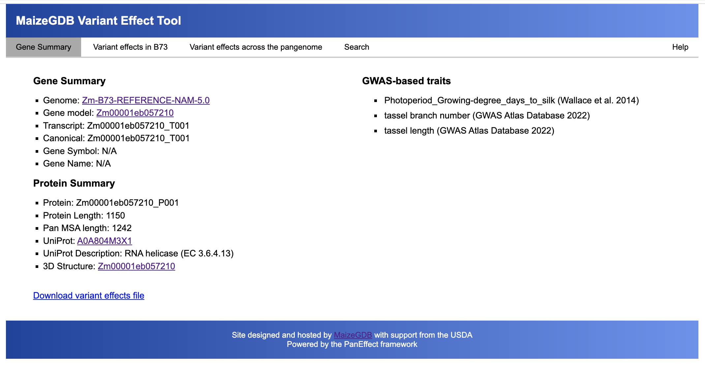
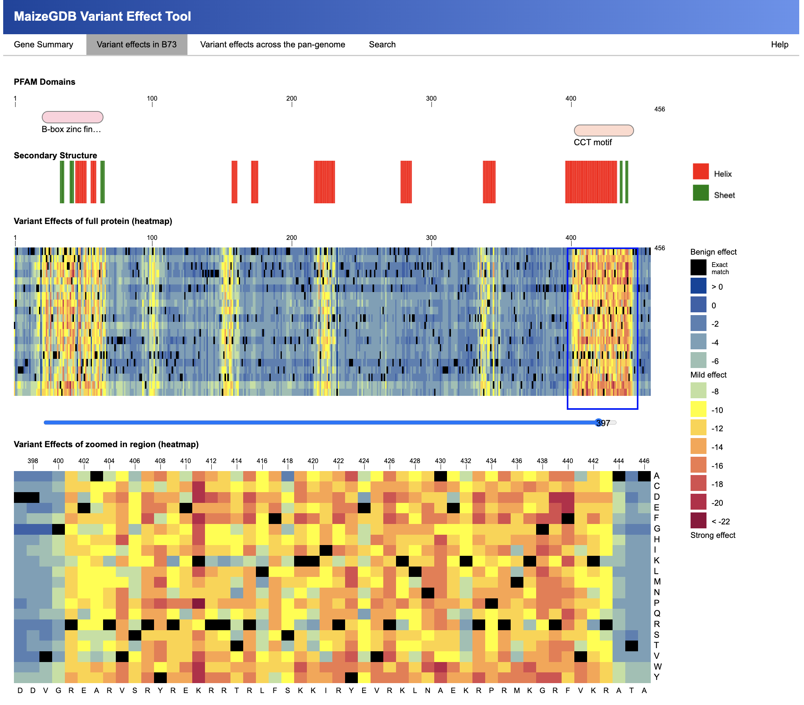
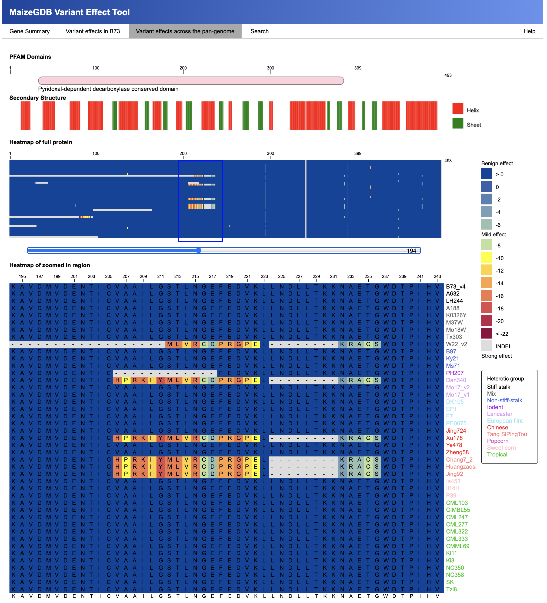
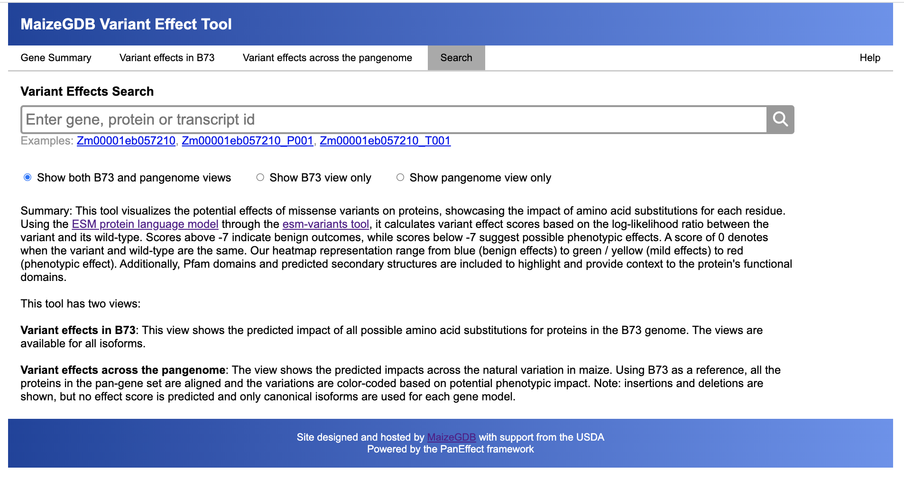
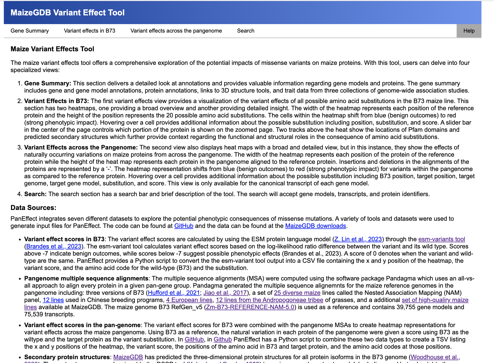

# PanEffect
PanEffect is a JavaScript framework to explore variant effects across a pan-genome.  The tool has two views that allows a user to (1) explore all possible amino acid substitutions and their variant effects for a reference genome, and (2) view the natural variation and their effects across a pan-genome.

## MaizeGDB instance of PanEffect

https://www.maizegdb.org/effect/maize/

## Citation

Andorf, et al. PanEffect: A pan-genome visualization tool for variant effects in maize. bioRxiv 2023.09.25.559155; doi: https://doi.org/10.1101/2023.09.25.559155

## Browser Compatibility 

PanEffect is engineered using a JavaScript framework, ensuring that most of its functionalities operate directly within your local browser. To guarantee optimal performance and a seamless user experience, we have tested and fine-tuned the tool for compatibility with the latest versions of Google Chrome and Mozilla Firefox. However, users accessing PanEffect via the Safari browser might experience some performance inconsistencies. Notably, there can be delays in the visualization updates of large protein heatmaps, potentially impacting overall usability. Additionally, factors such as limited memory capacity on your device or having an excessive number of browser tabs open may contribute to slower page loading times and responsiveness. Should you encounter any issues beyond these, please do not hesitate to ask for assistance. You can contact Carson Andorf directly at carson.andorf@usda.gov or use the MaizeGDB Feedback Form to report problems or provide feedback.

# PanEffect website

## PaneEffect website description

The PanEffect web interface has five components: Gene Summary, Variant Effects in reference genome, Variant Effects across the Pan-genome, Search, and Help. Each component is fully client-side using JavaScript to manage the front-end visualization. Figure 1 provides an overview of the reference genome view and Figure 2 shows pan-genome view. PanEffect is organized into one HTML file, five Javascript files, and a CSS file. The index HTML file contains the framework for the displays. The Javascript files manage the data loading (main.js), reference genome visualization (genome.js), pan-genome visualization (pan.js), webpage layout (dom.js), and support functions (support.js). The CSS file store the styles and formatting of the tool. A description of each of the five major components, provided as tabs in PanEffect, is provided below.

### Gene Summary
This section provides a detailed look at annotations and valuable information regarding gene models and proteins. The gene summary is customizable for each instance of PanEffect. The MaizeGDB instance includes gene and gene model annotations from MaizeGDB, protein annotations from UniProt, links to 3D structure tools, and trait data from three collections of genome-wide association studies.



### Variant Effects in reference genome
The first variant effects view provides a visualization of the variant effects of all possible amino acid substitutions for a reference genome. This section has two heatmaps, one providing a broad overview and another providing detailed insight. The width of the heatmap represents each position of the reference protein and the height of the position represents the 20 possible amino acid substitutions. The cells within the heatmap shift from blue (benign outcomes) to red (strong phenotypic impact). Hovering over a cell provides additional information about the possible substitution including position, substitution, and score. A slider bar in the center of the page controls which portion of the protein is shown in the zoomed page. Two tracks above the heat show the locations of Pfam domains and predicted secondary structures which further provide context regarding the functional and structural roles in the consequence of amino acid substitutions. 



### Variant Effects across the Pan-genome
The second view also displays heatmaps with a broad and detailed view, but in the pan-genome instance, they show the effects of naturally occurring variations across the pan-genome. The width of the heatmap represents each position of the protein of the reference protein while the rows of the heatmap represent each protein in the pan-genome aligned to the reference protein. Insertions and deletions in the alignments of the proteins are characterized by a ‘-’. The heatmap representation shifts from blue (benign outcomes) to red (strong phenotypic impact) for variants within the pan-genome as compared to the reference protein. Hovering over a cell provides additional information about the possible substitution including reference position, target position, target genome, target gene model, substitution, and score. This view is only available for the canonical transcript of each gene model. 



### Search
The search section has a search bar and short summary of the tool. The search will accept gene models, transcripts, and protein identifiers.



### Help
The help section provides summaries of each of the visualization components.  It also provides descriptions and links to the data sources, tools, downloads, and references used to create PanEffect. 



## PanEffect website directory structure

```bash
website/
├── css
    └── main.css
├── csv
├── dssp
├── heatmap
├── img
    └── loading.gif
├── index.html
├── js
    ├── dom.js
    ├── genome.js
    ├── main.js
    ├── pan.js
    └── support.js
├── pfam
├── query
├── synonym  
├── target
└── uniprot
```
Each of the  data directories has a sample entry for the B73 gene model Zm00001eb057210.

# Building PanEffect datasets

## Download full maize datasets

https://ars-usda.app.box.com/v/maizegdb-public/folder/225221910694

## Requirements

- Python
- Python librairies argparse, biopython, collections, csv, pandas, torch
- The esm-variant tools works using a CPUs but runs a lot faster on GPU hardware. Pre-computed variant scores for many maize genomes are available here: https://ars-usda.app.box.com/v/maizegdb-public/folder/222631922387

## Variant effect heatmaps for a reference genome

Clone and install the tool esm-variants from github: https://github.com/ntranoslab/esm-variants and run the following commands.

Run esm-variants on your protein FASTA file (see examples) and save it to a CSV file:
```bash
python esm_score_missense_mutations.py --input-fasta-file proteins.fasta --output-csv-file proteins.csv
```

Use the split_esm_output_for_website.py script to convert the esm-variant output file into a CSV file for each gene model.  Save the files into the csv directory.  These files contains the x and y position of the heatmap, the variant score, and the amino acid code for the wild-type (B73) and the substitution. 
```bash
python split_esm_output_for_website.py proteins.csv ./csv/
```

## Generating MSAs

There are many different programs available to generate pan-genomes or gene families that can be used by PanEffect.  The two tools we tested were pandagma (https://github.com/legumeinfo/pandagma) and Orthofiner (https://github.com/davidemms/OrthoFinder).  Follow the steps in either approach to create a set of pan-genomes.  Next generate a MSA using FAMSA (https://github.com/refresh-bio/FAMSA).  For example, if using Orthofinder to generate orthogroups, loop through the Orthogroup_Sequences directory 

```bash
conda install -c bioconda famsa

#Create individual fasta files for each protein
filelist=$(ls ${BASE_DIR}/Orthogroup_Sequences/*.fa)
for filename_path in $filelist; do
        filename=$(basename "$filename_path")
        famsa ${BASE_DIR}/Orthogroup_Sequences/${filename} ${BASE_DIR}/msa/${filename}.famsa
done
```

## Variant effect heatmaps for a pan-genome

These next steps combine the output from the esm-variants with the multiple seqeunce alignments of the proteins in a pan-genome.  Step 1, download or generate multiple sequence alignments and store the FASTA seqeunces in a FASTA file.  Next, run three Python scripts to create heatmap, target, and query TSV files.

Step 2: use format_pan_heatmap.py to convert each FASTA file into a TSV that list the x and y position of the heatmap, the variant score, the positions of the amino acid in B73 and target protein, and the amino acid codes at those positions.
```bash
python format_pan_heatmap.py ./msa/ ./heatmap/
```
Step 3: use format_pan_target.py to convert each FASTA file into a TSV that list the y position of the heatmap and the gene model and genome name associated with that row of the heatmap.  This script will need to be modified for the genomes in the desired pan-genome. 

```bash
python format_pan_target.py ./msa/ ./target/
```
Step 4: use format_pan_query.py to convert each FASTA file into a TSV that list the x position in the heatmap with the correspond x position in the reference protein (they might be different due to insertions and deletions in the alignments) and the amino acid at that position.
```bash
python format_pan_query.py ./msa/ ./query/
```

## Pfam domains

Run the make_pfam_files.py script on a Interproscan output file (see examples). The script generates a separate TSV file containing the Interproscan (including PfAM position, ID, name, and Gene Ontology terms) for each transcript and saves them in the pfam directory.
```bash
python make_pfam_files.py proteins_interproscan.tsv ./pfam/B73/
```

You can also use Hmmer to generate Pfam domains be following the instuctions here: http://hmmer.org/ 

A sample commmand to build domains using hmmscan and the Pfam-A libraries:

```bash
hmmscan --cpu 14 --domtblout ./domains/output.domains Pfam-A.hmm proteins.fa
```

Next run the following command 

```bash
#Arguments include input file, e-value cutoff, and output directory
python create_domains_from_hmmer.py ./domains/output.domains .001 ./pfam/
```

The output directory will contain one file for each protein listing the Pfam domains

## GWAS trait annotations

Run the create_trait_file.py script to find any SNP position within N base pairs of the start and end position of a gene model. 

```bash
python create_trait_file.py gene_model.gff gwas_snp.gff gene_model_gwas.tsv 1000 'name' 'Wallace et. al'
```
The data for the three datasets are merged and a final TSV file is created for each gene model listing the trait name and which study it came from. 

Arguments:
| Files/Parameters        | Description                                                                           |
|-------------------------|---------------------------------------------------------------------------------------|
| `gene_model.gff`        | Gene model annotation GFF                                                              |
| `gwas_snp.gff`          | GWAS GFF that associates a trait or phenotype to a SNP location                        |
| `gene_model_gwas.tsv`   | output filename                                                                       |
| `1000`                  | How many base pairs to expand the start and end positions of a gene model when searching for a nearby SNP |
| `'name'`                | What is the trait named in the last column of the GFF, examples include 'id' 'name' 'trait'   |
| `'Wallace et. al'`      | Short name of the source or reference for the data                                     |


Next, if you have multiple sources of trait data, combine thae data into a singele file then run the script make_trait_tsv_files.py, that creates a TSV file listing the gene model, trait, and source for each gene model.
```bash
python make_trait_tsv_files.py gene_model_gwas.tsv ./traits/
```

## Functional annotations

This step most likely will need to be customized for the organism that is being used as the reference.  Create a TSV file for the annotations that will be displayed in the gene summary section of PanEffect.  For example the TSV for annotations downloaded from MaizeGDB include the following headers:  

| Headers                         |
|---------------------------------|
| `B73_v5_model`                  |
| `B73_v5_canonical_transcript`   |
| `Chr`                           |
| `Start`                         |
| `End`                           |
| `Uniprot_id`                    |
| `Uniprot_description`           |
| `Uniprot_GO_terms`              |
| `MaizeGDB_gene_symbol`          |
| `MaizeGDB_gene_name`            |


The script make_gene_model_annotation_files.py will take the input TSV and create sperate files for each gene model transcript.
```bash
python make_gene_model_annotation_files.py annotations.tsv ./uniprot/
```

## Protein secondary structures

The secondary structure assignemnts are based on PDB files for each gene model isoform.  The PDB files can be from either AlphaFold, ESMFold, or another 3D protein prediction method.  For the MaizeGDB instance, protein structures were predicted using ESMFold at https://github.com/facebookresearch/esm.

Next, Install DSSP by using conda or pip
```bash
pip install -c salilab dssp
```
Use the make_dssp_files.sh shell script that calls both mkdssp and process_dssp_tsv.py that loops through all the PDB files in a directory and creates a TSV file with the position, amino acid, and secondary structure code for each B73 isoform.
```bash
make_dssp_files.sh ./PDB/ ./dssp_tmp/ ./dssp/ ./python/
```
Where 
| Directories/Parameters   | Description                                                                         |
|-------------------------|-------------------------------------------------------------------------------------|
| `./PDB/`                | Directory where the PDBs are located                                                |
| `./dssp_tmp/`           | A temporary directory that stores the direct output from mkdssp                     |
| `./dssp/`               | The directory that stores the TSV files                                             |
| `.`                     | The directory where `process_dssp_tsv.py` is located                                 |

